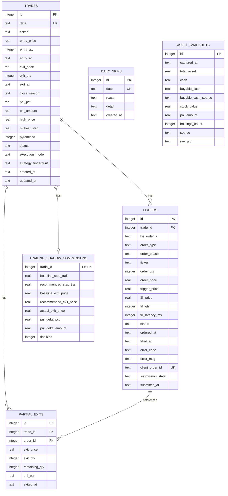

# DB 설계 문서 — SQLite

> **버전**: 1.3
> **최종 수정**: 2026-08-07
> **대상 파일**: `data/db/trading.db`

---

## 1. 설계 원칙

| 원칙 | 내용 |
|------|------|
| 단일 파일 | `data/db/trading.db` — 백업이 파일 복사 한 번 |
| WAL 모드 | 읽기/쓰기 병목 최소화 (`PRAGMA journal_mode=WAL`) |
| 타임스탬프 | 전부 ISO 8601 KST (`2026-06-23T09:00:01+09:00`) |
| 가격 | `REAL` (소수점 허용) |
| 수량 | `INTEGER` |
| Enum 값 | `TEXT` CHECK 제약으로 강제 |
| 운영 상태 | `today_state.json` 유지 — crash recovery 전용 |
| 분석/이력 | SQLite (`trades`, `orders`, `entry_order_attempts`, `partial_exits`, `daily_skips`, `asset_snapshots`, `trailing_shadow_comparisons`) |
| 실험/설정/경로 | SQLite (`strategy_configs`, `experiment_registry`, `price_path_manifests`) — 0단계 계측 기준선 |

---

## 2. ERD (텍스트)

```
trades (1) ──< orders       (N)
trades (1) ──< partial_exits(N)
trades (1) ──  trailing_shadow_comparisons(0..1)
trades (1) ──  daily_skips  (date 기준 선택적)
entry_order_attempts        (체결 전 진입 주문 감사, trade와 독립)
asset_snapshots             (KIS 자산 조회 이력)
```

### Mermaid ERD



`daily_skips`는 `trades.date`와 업무적으로 같은 거래일을 공유하지만 FK는 두지 않는다. `asset_snapshots`는 KIS 잔고 조회 시각 기준 이력이므로 거래 테이블과 직접 연결하지 않는다.

---

## 3. 테이블 정의

### 3-1. `trades` — 일별 거래 마스터

하루 최대 1건. 진입부터 청산까지 라이프사이클 전체.

```sql
CREATE TABLE IF NOT EXISTS trades (
    id           INTEGER PRIMARY KEY AUTOINCREMENT,

    -- 식별
    date         TEXT NOT NULL UNIQUE,          -- 'YYYYMMDD'
    ticker       TEXT NOT NULL,                 -- 종목코드 (예: '005930')

    -- 진입
    entry_price  REAL,                          -- 가중평균 체결가 (피라미딩 포함)
    entry_qty    INTEGER,                       -- 총 진입 수량
    entry_at     TEXT,                          -- ISO8601 KST

    -- 청산
    exit_price   REAL,                          -- 가중평균 청산가
    exit_qty     INTEGER,                       -- 총 청산 수량
    exit_at      TEXT,                          -- ISO8601 KST
    close_reason TEXT CHECK (close_reason IN (
                     'TRAILING','HARD_STOP','BEP_STOP',
                     'TIMEOUT','SLIPPAGE_GUARD','ENTRY_FAIL',
                     'MANUAL'
                 )),

    -- 손익
    pnl_pct      REAL,                          -- 진입 대비 전체 P&L %
    pnl_amount   REAL,                          -- 손익 원화 (수수료 미포함)

    -- 추적
    high_price   REAL,                          -- 보유 중 최고가 (Trailing 기준)
    pyramided    INTEGER DEFAULT 0,             -- 2차 매수 실행 여부 (0/1)

    -- 상태
    status       TEXT NOT NULL DEFAULT 'OPEN'
                     CHECK (status IN ('OPEN','CLOSED','SKIPPED')),

    execution_mode TEXT,                       -- PAPER/REAL 실적 구분
    strategy_fingerprint TEXT,                 -- 핵심 전략 코드 내용 지문

    created_at   TEXT NOT NULL,
    updated_at   TEXT NOT NULL
);

CREATE INDEX IF NOT EXISTS idx_trades_date ON trades(date);
```

#### 컬럼 보충

| 컬럼 | 설명 |
|------|------|
| `entry_price` | 1차+2차 체결가 가중평균. 2차 없으면 1차 그대로 |
| `pnl_amount` | `(exit_price − entry_price) × exit_qty` 단순 계산 |
| `pyramided` | F3에서 2차 30% 매수가 체결됐으면 1 |
| `execution_mode` | 진입 당시 `KIS_MODE`; 준비도 계산은 PAPER만 인정 |
| `strategy_fingerprint` | 동일 전략 코드와 비밀값 제외 유효 환경설정의 PAPER 실적만 집계하기 위한 지문 |

---

### 3-2. `orders` — 개별 KIS 주문

진입·청산 모든 주문 1건 = 1행.

```sql
CREATE TABLE IF NOT EXISTS orders (
    id           INTEGER PRIMARY KEY AUTOINCREMENT,
    trade_id     INTEGER NOT NULL REFERENCES trades(id),

    -- KIS 주문 식별자
    kis_order_id TEXT,                          -- KIS odno (체결 전 공란 가능)

    -- 구분
    order_type   TEXT NOT NULL CHECK (order_type  IN ('BUY','SELL')),
    order_phase  TEXT NOT NULL CHECK (order_phase IN (
                     'FIRST_BUY',               -- F3 1차 70%
                     'PYRAMID_BUY',             -- F3 2차 30%
                     'PARTIAL_SELL',            -- F4 1차 익절 50%
                     'CLOSE_SELL',              -- F4 청산 (TRAILING/HARD/BEP)
                     'TIMEOUT_SELL',            -- F5 타임아웃 청산
                     'SLIPPAGE_SELL',           -- F3 슬리피지 즉시 청산
                     'CANCEL'                   -- 주문 취소
                 )),

    -- 주문 내용
    ticker       TEXT NOT NULL,
    order_qty    INTEGER NOT NULL,              -- 주문 수량
    order_price  REAL,                          -- 요청 기준가 (시장가=0)
    trigger_price REAL,                         -- 주문 판단 시점 기준가/실행 트리거가

    -- 체결 결과
    fill_price   REAL,                          -- 실제 체결가
    fill_qty     INTEGER,                       -- 실제 체결 수량
    fill_latency_ms INTEGER,                    -- 주문 호출 직전→체결 확인 소요시간

    -- 상태
    status       TEXT NOT NULL DEFAULT 'PENDING'
                     CHECK (status IN (
                         'PENDING','FILLED','PARTIAL_FILL',
                         'CANCELLED','FAILED'
                     )),

    ordered_at   TEXT NOT NULL,                 -- 주문 시각
    filled_at    TEXT,                          -- 체결 시각 (미체결=NULL)
    error_code   TEXT,                          -- KIS 에러코드
    error_msg    TEXT,                          -- KIS 에러메시지

    -- 주문 응답 유실 복구
    client_order_id TEXT,                       -- 전송 전 생성한 로컬 상관 ID
    submission_state TEXT NOT NULL DEFAULT 'ACKNOWLEDGED',
                                                 -- PREPARED/SUBMITTING/UNKNOWN/ACKNOWLEDGED/REJECTED
    submitted_at TEXT                            -- 실제 전송 시작 시각
);

CREATE INDEX IF NOT EXISTS idx_orders_trade_id    ON orders(trade_id);
CREATE INDEX IF NOT EXISTS idx_orders_kis_order_id ON orders(kis_order_id);
CREATE UNIQUE INDEX IF NOT EXISTS idx_orders_client_order_id
    ON orders(client_order_id) WHERE client_order_id IS NOT NULL;
```

매도는 `PREPARED → SUBMITTING → ACKNOWLEDGED` 순으로 기록한다. 전송 결과를
확정할 수 없으면 `UNKNOWN`으로 남기고 주문시각·종목·수량을 KIS 당일 주문과
대사한다. 유일한 일치 주문을 찾기 전에는 같은 수량을 자동 재주문하지 않는다.

---

### 3-2-1. `entry_order_attempts` — 체결 전 진입 주문 감사

체결 전에는 당일 `trades` 행을 만들 수 없다. 무체결 취소 뒤 다른 후보가 체결될 수 있고 `trades.date`가 UNIQUE이기 때문이다. 따라서 KIS가 접수한 진입 주문은 상태 파일을 먼저 저장한 다음 이 독립 테이블에 즉시 기록한다.

- 식별·갱신 키: `(date, kis_order_id)` UNIQUE. 프로세스 로컬 `id`를 복구 키로 사용하지 않는다.
- 상태: `PENDING`, `CANCELLED`, `PARTIAL_FILL`, `FILLED`, `UNCERTAIN`
- 저장값: 종목·시도번호·주문 단계(`FIRST_BUY`/`PYRAMID_BUY`)·주문수량·제출 지정가·판단 기준가·체결 결과
- 체결된 주문은 이후 `trades`와 `orders`에 정상 기록한다. `/api/orders`는 같은 KIS 주문번호의 `orders`가 없을 때만 감사 행을 합쳐 반환한다.
- 최초 `PENDING` 기록은 상태 파일 저장 뒤 비동기로 실행하며 기본 250ms 안에 중단한다. 감사 DB 지연·실패는 이미 접수된 주문의 체결조회·취소 대사를 중단시키지 않는다.
- 복구 및 정상 대사의 최종 상태도 같은 자연키로 UPSERT한다. 따라서 최초 기록 전 프로세스가 종료되거나 `UNCERTAIN`이 먼저 기록돼도 이후 `CANCELLED`/`PARTIAL_FILL`/`FILLED`로 확정할 수 있다. 늦게 완료된 `PENDING`은 확정 상태를 되돌리지 않는다.
- `order_phase`가 없던 기존 감사 행은 마이그레이션 시 `FIRST_BUY`로 보존하고, 신규 PYRAMID 복구 행은 `PYRAMID_BUY`로 기록해 `/api/orders`에서 최초 진입과 구분한다.

---

### 3-2-2. `asset_snapshots` — KIS 자산 조회 이력

자산 메뉴의 현재값은 KIS 잔고 조회가 원천이지만, 조회 성공 결과는 장애 분석과 감사 추적을 위해 DB에도 저장한다.

```sql
CREATE TABLE IF NOT EXISTS asset_snapshots (
    id                  INTEGER PRIMARY KEY AUTOINCREMENT,
    captured_at         TEXT NOT NULL,          -- ISO8601 KST
    total_asset         REAL,                   -- 총평가금액
    cash                REAL,                   -- 예수금
    buyable_cash        REAL,                   -- 주문가능금액
    buyable_cash_source TEXT,                   -- ord_psbl_cash | dnca_tot_amt | prvs_rcdl_excc_amt
    stock_value         REAL,                   -- 주식평가금액
    pnl_amount          REAL,                   -- 평가손익
    holdings_count      INTEGER,                -- 보유종목 수
    source              TEXT NOT NULL DEFAULT 'KIS',
    raw_json            TEXT                    -- KIS 원 응답 JSON
);

CREATE INDEX IF NOT EXISTS idx_asset_snapshots_captured_at
    ON asset_snapshots(captured_at);
```

---

### 3-2-3. `trailing_shadow_comparisons` — 기존/추천 트레일 청산 비교

거래당 최대 1행이다. 기존 1.5% 선이 먼저 맞은 최초 틱을 보존하고, 실제 전략이
종료되면 현재 2.0% 결정 틱·실제 체결가·수수료 제외 손익 차이를 최종화한다.
`baseline_exit_price`와 `recommended_exit_price`는 주문 체결가가 아니라 동일한
틱 기준의 전략 비교값이며, 확인 체결가는 `actual_exit_price`에 별도로 둔다.

주요 필드는 다음과 같다.

- 설정: `baseline_step_trail`, `recommended_step_trail`
- 청산선: `baseline_stop_price`, `recommended_stop_price`
- 비교 청산가: `baseline_exit_price`, `recommended_exit_price`
- 실제 결과: `actual_exit_price`, `actual_pnl_pct`, `close_reason`
- 차이: `pnl_delta_pct`, `pnl_delta_amount` (추천 - 기존)
- 완료 여부: `finalized`

분석·비교 집계에는 최종화된 행만 사용하며 반드시 `WHERE finalized = 1`로
필터링한다. `finalized = 0` 행은 기존 1.5% 선의 최초 도달만 기록된 미완료 관측이다.

`trade_id`는 `trades(id)`에 대한 PK/FK이며 거래 삭제 시 함께 삭제한다.

---

### 3-3. `partial_exits` — 1차 익절 상세

F4 `_first_partial_exit()` 실행 시 1행 삽입.

```sql
CREATE TABLE IF NOT EXISTS partial_exits (
    id           INTEGER PRIMARY KEY AUTOINCREMENT,
    trade_id     INTEGER NOT NULL REFERENCES trades(id),
    order_id     INTEGER REFERENCES orders(id),

    exit_price   REAL NOT NULL,
    exit_qty     INTEGER NOT NULL,
    remaining_qty INTEGER NOT NULL,             -- 익절 후 잔여 수량
    pnl_pct      REAL,                          -- 해당 시점 진입가 대비 %

    exited_at    TEXT NOT NULL
);

CREATE INDEX IF NOT EXISTS idx_partial_exits_trade_id ON partial_exits(trade_id);
```

---

### 3-4. `daily_skips` — 당일 거래 스킵 이력

거래 없이 스킵된 날 기록. F1 NO_TARGET, 슬리피지 즉시 청산 등.

```sql
CREATE TABLE IF NOT EXISTS daily_skips (
    id         INTEGER PRIMARY KEY AUTOINCREMENT,
    date       TEXT NOT NULL UNIQUE,            -- 'YYYYMMDD'
    reason     TEXT NOT NULL CHECK (reason IN (
                   'NO_TARGET',                 -- F1 필터 통과 종목 없음
                   'GAP_CHANGED',               -- F3 갭 재검증 실패
                   'ENTRY_FAIL',                -- F3 미체결
                   'SLIPPAGE_GUARD',            -- F3 슬리피지 초과
                   'MANUAL'                     -- 수동 스킵
               )),
    detail     TEXT,                            -- 부가 정보 (JSON 문자열)
    created_at TEXT NOT NULL
);
```

---

## 4. PRAGMA 초기 설정

```sql
PRAGMA journal_mode = WAL;       -- 읽기/쓰기 동시성
PRAGMA synchronous   = NORMAL;   -- WAL에서 안전하며 fsync 부담 감소
PRAGMA foreign_keys  = ON;       -- 참조 무결성 강제
PRAGMA cache_size    = -8000;    -- 8 MB 캐시
```

---

## 5. 주요 쿼리 예시

### 5-1. 최근 30일 승률

```sql
SELECT
    COUNT(*)                                      AS total,
    SUM(CASE WHEN pnl_pct > 0 THEN 1 ELSE 0 END) AS wins,
    ROUND(AVG(pnl_pct), 2)                        AS avg_pnl_pct,
    ROUND(MIN(pnl_pct), 2)                        AS worst,
    ROUND(MAX(pnl_pct), 2)                        AS best
FROM trades
WHERE status = 'CLOSED'
  AND date >= strftime('%Y%m%d', date('now','-30 days'));
```

### 5-2. 청산 사유별 집계

```sql
SELECT close_reason,
       COUNT(*)          AS cnt,
       ROUND(AVG(pnl_pct), 2) AS avg_pnl
FROM trades
WHERE status = 'CLOSED'
GROUP BY close_reason
ORDER BY cnt DESC;
```

### 5-3. 특정 날짜 전체 주문 타임라인

```sql
SELECT o.order_phase, o.order_type, o.fill_price, o.fill_qty,
       o.fill_latency_ms, o.ordered_at, o.filled_at
FROM orders o
JOIN trades t ON t.id = o.trade_id
WHERE t.date = '20260623'
ORDER BY o.ordered_at;
```

### 5-4. 1차 익절 발생률

```sql
SELECT
    COUNT(DISTINCT t.id)              AS total_trades,
    COUNT(DISTINCT pe.trade_id)       AS partial_exit_trades,
    ROUND(
        COUNT(DISTINCT pe.trade_id) * 100.0 / COUNT(DISTINCT t.id), 1
    )                                 AS partial_exit_rate_pct
FROM trades t
LEFT JOIN partial_exits pe ON pe.trade_id = t.id
WHERE t.status = 'CLOSED';
```

---

## 6. Python 모듈 구조

```
src/
└── db.py          ← 단일 모듈 (aiosqlite)
```

```python
# src/db.py — 공개 인터페이스 (예정)

async def init(db_path: str) -> None: ...
    # CREATE TABLE IF NOT EXISTS + PRAGMA 설정

async def open_trade(date: str, ticker: str) -> int: ...
    # trades INSERT → id 반환

async def record_order(trade_id: int, ...) -> int: ...
    # orders INSERT → id 반환

async def update_order_fill(order_id: int, fill_price: float,
                            fill_qty: int, latency_ms: int) -> None: ...

async def record_partial_exit(trade_id: int, order_id: int, ...) -> None: ...

async def close_trade(trade_id: int, exit_price: float,
                      close_reason: str, pnl_pct: float, highest_step: float,
                      *, exit_qty: int, high_price: float | None) -> None: ...

async def record_skip(date: str, reason: str, detail: dict) -> None: ...
```

---

## 7. 패키지 추가

```text
# requirements.txt 추가
aiosqlite==0.20.0
```

---

## 8. 데이터 흐름 (모듈 → DB)

```
F1  run()               → daily_skips (NO_TARGET)
F2  run()               → (없음, 선택 종목은 state에)
F3  run()/recovery      → entry_order_attempts.upsert(PENDING, 비동기·시간제한)
                           entry_order_attempts.upsert(CANCELLED | PARTIAL_FILL | FILLED | UNCERTAIN)
                           trades.open_trade() [체결 확인 후]
                           orders.record_order(FIRST_BUY)
                           orders.update_order_fill()
                           orders.record_order(PYRAMID_BUY) [조건부]
                           orders.record_order(SLIPPAGE_SELL) [조건부]
                           daily_skips (SLIPPAGE_GUARD / ENTRY_FAIL)
F4  _first_partial_exit()  → partial_exits.record()
                             orders.record_order(PARTIAL_SELL)
    _execute_close()        → orders.record_order(CLOSE_SELL)
                             orders.update_order_fill(PARTIAL_FILL | FILLED)
                             trades.close_trade() [전량 체결 확인 시]
F5  execute()           → 잔고 재검증
                           orders.record_order(TIMEOUT_SELL, PENDING)
                           orders.update_order_fill(확인된 체결수량)
                           trades.close_trade(close_reason='TIMEOUT') [전량·체결가 확인 시]
```

### F4 기록 규칙

- 주문 응답에서 접수와 주문번호를 확인한 뒤 상태 파일은 `EXITING`으로 먼저 영속화한다.
- 주문수량보다 확인된 누적 체결수량이 작으면 `orders.status=PARTIAL_FILL`과 실제 `fill_qty`를 기록한다.
- 체결을 확인하지 못하면 `orders.status=PENDING`, `fill_price=NULL`, `fill_qty=NULL`로 유지한다.
- 부분·미확인 체결에서는 `trades.status=OPEN`을 유지한다. 트리거 가격을 체결가로 대신 기록하지 않는다.
- 요청수량 전량 체결을 확인한 경우에만 `orders.status=FILLED`와 `trades.close_trade()`를 확정한다.
- DB 기록 실패는 매도 주문 실패와 분리하며, DB 오류만으로 같은 매도 주문을 다시 보내지 않는다.

### F5 기록 규칙

- 주문 API가 접수된 직후 `orders` 행을 `PENDING`으로 생성한다.
- 부분체결 주문은 `PARTIAL_FILL`과 `fill_qty < order_qty`로 기록하며, 취소 확정 뒤 전송한 잔량 주문은 별도 `orders` 행으로 남긴다.
- 실제 잔고가 0이어도 체결가를 확인하지 못하면 `trades`를 임의 가격으로 닫지 않고 `TIMEOUT_CLOSE_UNVERIFIED` 이벤트로 수동 대조를 요청한다.
- 주문 전송 성공 후 발생한 `orders`/`trades` DB 기록 오류는 매도 주문 실패와 분리한다. DB 오류만으로 동일 주문을 다시 보내지 않는다.

### 상태 파일과 DB의 청산 책임

- 상태 파일은 `position_status`, `close_reason`, `remaining_qty`를 저장한다.
- `orders`는 KIS 주문번호, 주문수량, 실제 체결수량, 체결가와 PENDING/PARTIAL_FILL/FILLED 상태를 저장한다.
- `trades`는 전량 체결과 체결가가 확인된 최종 청산만 CLOSED로 저장한다.
- EXITING 재시작 시 상태 파일과 OPEN 거래·주문 행을 함께 대조할 수 있어야 하며,
  자동 재매도보다 운영자 확인을 우선한다.

---

## 9. 파일 위치 및 백업

| 항목 | 경로 |
|------|------|
| DB 파일 | `data/db/trading.db` |
| WAL 파일 | `data/db/trading.db-wal` (자동 생성) |
| 백업 스크립트 | `scripts/backup_db.py` (미구현) |

> `.gitignore`에 `data/db/` 추가 필요 (실거래 데이터 노출 방지).

---

## 10. 주의사항

1. **aiosqlite 단일 연결** — 멀티스레드 아님. `asyncio` 이벤트 루프 1개에서 단일 `aiosqlite.Connection` 공유.
2. **WAL 체크포인트** — 프로세스 정상 종료 시 자동 체크포인트. 비정상 종료 후 재시작해도 WAL에서 복구됨.
3. **today_state.json 병행 유지** — DB는 분석/이력용. 운영 중 빠른 상태 읽기는 여전히 `state.py` 인메모리 + `today_state.json`.
4. **마이그레이션** — 스키마 변경 시 `ALTER TABLE` 또는 버전 테이블(`schema_version`) 관리 필요 (현재 미구현).
---

## 2026-07-01 기록 정책 업데이트

### DRY_RUN 데이터 분리

- `DRY_RUN=1` 실행 시 운영 DB와 분리된 `DRY_RUN_DB_DIR` 경로를 사용한다.
- 기본값은 `data/dry_run/db`이며, 운영 DB(`data/db/trading.db`)를 오염시키지 않는다.
- DRY_RUN에서 상태 충돌로 F3가 생략되면 `daily_skips`에 `DRY_RUN_F3_SKIPPED` 사유를 기록한다.

### F3 실패 기록

- 진입 주문이 최종 미체결이면 `daily_skips.reason='ENTRY_FAIL'`로 기록한다.
- `detail`에는 가능한 경우 주문번호, 실패 사유, 체결조회 요약을 포함한다.
- 주문 전송 후 미체결이면 실제 미체결 주문 취소 이벤트는 로그(`ENTRY_CANCEL_SENT`)에 남긴다.

### 로그와 DB 역할 구분

- 주문/체결의 영속 기록은 `orders`, `trades`, `daily_skips`가 담당한다.
- 재시도 시도 횟수, 체결조회 타임아웃, KIS 응답 코드처럼 진단용 세부 정보는 JSONL 이벤트 로그에 남긴다.
- UI의 하단 파이프라인 진행 단계는 DB가 아니라 당일 JSONL 로그를 기준으로 계산한다.

### UI 메뉴와 데이터 원천

- 자산 메뉴의 원천은 KIS 잔고 조회(`/api/assets`)의 현재 스냅샷이며, 조회 성공 결과는 `asset_snapshots` 테이블에 이력으로 저장한다.
- `/api/assets`는 서버 메모리 캐시가 비어 있으면 마지막 `asset_snapshots` 행을 fallback으로 반환할 수 있다.
- 주문 메뉴는 `orders` 테이블을 주 원천으로 삼고, 체결조회 타임아웃/취소 전송/실패 사유 같은 진단 정보는 JSONL 이벤트 로그를 보조로 사용한다.
- `주문가능금액`은 자산 메뉴 데이터로 분류한다. 주문 메뉴에서 표시할 경우 주문 판단용 참조값으로만 사용한다.
